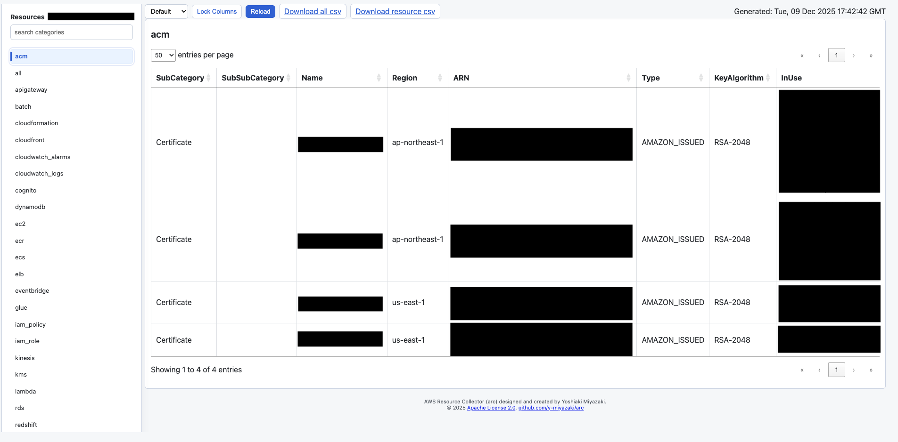

# ARC - AWS Resource Collector


[](https://github.com/y-miyazaki/arc/releases/latest)
[](https://github.com/y-miyazaki/arc/actions/workflows/cd-release-go.yaml)

ARC is a command-line tool for collecting AWS resource information across multiple services and regions, generating organized CSV files and an interactive HTML viewer for easy browsing.

## Features

- 🚀 **Fast & Concurrent** - Parallel collection of resources with configurable concurrency
- 📊 **Multiple Output Formats** - CSV files and interactive HTML viewer
- 🔍 **Comprehensive Coverage** - Support for 20+ AWS services: ACM, API Gateway, Batch, CloudFormation, CloudFront, CloudWatch Alarms, CloudWatch Logs, Cognito, DynamoDB, EC2, ECR, ECS, EFS, ElastiCache, ELB, EventBridge, IAM Policy, IAM Role, IAM User/Group, KMS, Lambda, RDS, Redshift, S3, Secrets Manager, SNS, SQS, VPC, WAF.
- 🌏 **Multi-Region Support** - Collect resources from multiple AWS regions
- 🎯 **Selective Collection** - Choose specific resource categories to collect
- 📁 **Organized Output** - Automatically organized by AWS account ID and resource type

## Screenshots

### Interactive HTML Viewer

ARC generates an interactive HTML viewer that allows you to browse collected resources with ease:


*Interactive HTML viewer showing AWS resources organized by service category*

The HTML viewer features:
- 📋 **Category Panels** - Collapsible panels for each AWS service
- 🔍 **Search & Filter** - Filter categories by name
- 📊 **DataTables Integration** - Sort, search, and paginate within each table
- 💾 **Download Options** - Download individual CSV files or the combined CSV
- 🔒 **Column Locking** - Lock columns for easier horizontal scrolling
- 📱 **Responsive Design** - Works on desktop and mobile browsers

## Table of Contents

- [Installation](#installation)
- [Quick Start](#quick-start)
- [Usage](#usage)
- [Supported AWS Services](#supported-aws-services)
- [Output Format](#output-format)
- [Configuration](#configuration)
- [Examples](#examples)
- [Development](#development)
- [Contributing](#contributing)
- [License](#license)

## Installation

### Using Go Install

```bash
go install github.com/y-miyazaki/arc/cmd/arc@latest
```

### Using Release tar.gz

You can download a prebuilt release tarball from the project's Releases page and install it quickly. The examples below use the v1.0.2 release; replace `v1.0.2` with the version you need.

Available platforms:
- Linux (amd64, arm64)
- macOS (amd64, arm64)
- Windows (amd64)

Linux (AMD64) example:

```bash
VERSION=v1.0.2 && ASSET=arc-${VERSION}-linux-amd64.tar.gz && curl -L https://github.com/y-miyazaki/arc/releases/download/${VERSION}/${ASSET} | tar -xzf - && sudo mv arc /usr/local/bin/ && sudo chmod +x /usr/local/bin/arc
```

macOS (ARM64) example:

```bash
VERSION=v1.0.2 && ASSET=arc-${VERSION}-darwin-arm64.tar.gz && curl -L https://github.com/y-miyazaki/arc/releases/download/${VERSION}/${ASSET} | tar -xzf - && sudo mv arc /usr/local/bin/ && sudo chmod +x /usr/local/bin/arc
```

Notes:
- The release typically ships a `arc-${VERSION}-checksums.txt` file; prefer verifying the checksum before installing.
- For Windows, download the `.zip` asset from the Releases page and extract the `arc.exe` binary.
- We recommend using the release tarballs for production/distribution. `go install` is convenient for development but will produce a full-featured build from source.

### Verify Installation

```bash
arc --version
```

## Quick Start

1. **Configure AWS Credentials**

```bash
# Using AWS CLI
aws configure

# Or set environment variables
export AWS_ACCESS_KEY_ID=your_access_key
export AWS_SECRET_ACCESS_KEY=your_secret_key
export AWS_DEFAULT_REGION=ap-northeast-1
```

2. **Collect All Resources**

```bash
arc --html
```

3. **View Results**

```bash
# CSV files will be in ./output/{account-id}/resources/
ls -lh ./output/*/resources/

# Open HTML viewer in browser
open ./output/*/index.html
```

### Serve the HTML locally (recommended)

The generated HTML viewer fetches CSV files over HTTP, so opening `index.html` with the `file://` protocol may fail due to browser restrictions. Start a simple local HTTP server in the `output` directory and open the viewer over `http://`.

Python 3 (built-in):

```bash
# Serve the whole output directory on port 8000
python3 -m http.server 8000 --directory ./output

# Or serve a specific account folder (replace ACCOUNT_ID)
python3 -m http.server 8000 --directory ./output/ACCOUNT_ID

# Bind to localhost for safety
python3 -m http.server 8000 --bind 127.0.0.1 --directory ./output

# Then open in your browser:
# http://127.0.0.1:8000/ACCOUNT_ID/index.html
```

Alternatives:

- Node.js: `npx http-server ./output -p 8000`
- Use your OS bundled web server if preferred. Serving via HTTP resolves fetch/CORS issues when loading CSVs from the HTML viewer.

## Usage

### Basic Commands

```bash
# Collect all resources in default region
arc

# Collect all resources with HTML output
arc --html

# Collect specific categories
arc -c ec2,s3,lambda

# Collect from specific region
arc -r us-east-1

# Collect from multiple regions
arc -r ap-northeast-1,us-east-1,eu-west-1

# Use specific AWS profile
arc --profile production

# Set output directory
arc -D /path/to/output

# Enable verbose logging
arc -v
```

### Command-Line Options

```
OPTIONS:
   --verbose, -v              Enable verbose output
   --region, -r value         AWS region(s) to use (comma-separated) (default: "ap-northeast-1") [$AWS_DEFAULT_REGION]
   --profile value            AWS profile to use [$AWS_PROFILE]
   --output, -o value         Output filename (default: "all.csv")
   --output-dir, -D value     Base output directory (default: "./output")
   --categories, -c value     Comma-separated list of categories to collect
   --html, -H                 Generate HTML index (default: false)
   --concurrency, -C value    Maximum number of concurrent AWS API requests (default: 5)
   --help, -h                 show help
```

## Supported AWS Services

| Service           | Category Name       | Description                                                      |
| ----------------- | ------------------- | ---------------------------------------------------------------- |
| ACM               | `acm`               | Certificate Manager                                              |
| API Gateway       | `apigateway`        | REST and HTTP APIs                                               |
| Batch             | `batch`             | Batch computing                                                  |
| CloudFormation    | `cloudformation`    | Infrastructure as Code stacks                                    |
| CloudFront        | `cloudfront`        | Content Delivery Network                                         |
| CloudWatch Alarms | `cloudwatch_alarms` | Monitoring alarms                                                |
| CloudWatch Logs   | `cloudwatch_logs`   | Log groups and streams                                           |
| Cognito           | `cognito`           | User pools and identity pools                                    |
| DynamoDB          | `dynamodb`          | NoSQL database tables                                            |
| EC2               | `ec2`               | Virtual machines and related resources                           |
| ECR               | `ecr`               | Container registry                                               |
| ECS               | `ecs`               | Container orchestration                                          |
| EFS               | `efs`               | Elastic File System                                              |
| ElastiCache       | `elasticache`       | In-memory cache                                                  |
| ELB               | `elb`               | Load balancers (ALB, NLB, CLB)                                   |
| EventBridge       | `eventbridge`       | Event buses and rules                                            |
| IAM Policy        | `iam_policy`        | Customer-managed IAM Policies                                    |
| IAM Role          | `iam_role`          | IAM Roles with attached policies and last used info              |
| IAM User/Group    | `iam_user_group`    | IAM Users and Groups                                             |
| KMS               | `kms`               | Key Management Service                                           |
| Lambda            | `lambda`            | Serverless functions                                             |
| RDS               | `rds`               | Relational databases                                             |
| Redshift          | `redshift`          | Data warehouse                                                   |
| S3                | `s3`                | Object storage                                                   |
| Secrets Manager   | `secretsmanager`    | Secrets storage                                                  |
| SNS               | `sns`               | Simple Notification Service                                      |
| SES               | `ses`               | Simple Email Service (identities, configuration sets, templates) |
| SQS               | `sqs`               | Simple Queue Service                                             |
| VPC               | `vpc`               | Virtual Private Cloud and networking                             |
| WAF               | `waf`               | Web Application Firewall                                         |

## Output Format

### Directory Structure

```
output/
└── {account-id}/
    ├── index.html           # Interactive HTML viewer
    ├── files.json          # Manifest for HTML viewer
    └── resources/
        ├── all.csv         # Combined CSV of all resources
        ├── ec2.csv         # EC2-specific resources
        ├── s3.csv          # S3-specific resources
        └── ...             # Other service-specific CSVs
```

### CSV Format

Each CSV file contains:
- **Category** - Service category (e.g., ec2, s3)
- **SubCategory** - Resource type (e.g., Instance, Bucket)
- **SubSubCategory** - Additional classification
- **Name** - Resource name
- **Region** - AWS region
- Service-specific attributes

### HTML Viewer

The interactive HTML viewer provides:
- 📋 Search and filter across all resources
- 🔄 Sort by any column
- 📊 Per-category collapsible panels
- 💾 Download CSV files
- 🔒 Fixed column scrolling
- 📱 Responsive design

## Configuration

### Environment Variables

- `AWS_ACCESS_KEY_ID` - AWS access key
- `AWS_SECRET_ACCESS_KEY` - AWS secret key
- `AWS_SESSION_TOKEN` - AWS session token (for temporary credentials)
- `AWS_DEFAULT_REGION` - Default AWS region
- `AWS_PROFILE` - AWS profile name

### AWS Permissions

The tool requires read-only permissions for the services you want to collect. Example IAM policy:

```json
{
  "Version": "2012-10-17",
  "Statement": [
    {
      "Effect": "Allow",
      "Action": [
        "acm:List*",
        "acm:Describe*",
        "apigateway:GET",
        "cloudformation:List*",
        "cloudformation:Describe*",
        "cloudfront:List*",
        "cloudfront:Get*",
        "cloudwatch:Describe*",
        "dynamodb:List*",
        "dynamodb:Describe*",
        "ec2:Describe*",
        "ecr:Describe*",
        "ecs:List*",
        "ecs:Describe*",
        "elasticache:Describe*",
        "elasticloadbalancing:Describe*",
        "events:List*",
        "events:Describe*",
        "iam:List*",
        "iam:Get*",
        "kms:List*",
        "kms:Describe*",
        "lambda:List*",
        "lambda:Get*",
        "rds:Describe*",
        "redshift:Describe*",
        "s3:List*",
        "s3:Get*",
        "secretsmanager:List*",
        "secretsmanager:Describe*",
        "ses:List*",
        "ses:Get*",
        "ses:Describe*",
        "sesv2:List*",
        "sesv2:Get*",
        "sns:List*",
        "sns:Get*",
        "sqs:List*",
        "sqs:Get*",
        "wafv2:List*",
        "wafv2:Get*"
      ],
      "Resource": "*"
    }
  ]
}
```

## Examples

### Collect Specific Resources

```bash
# Only EC2 instances and S3 buckets
arc -c ec2,s3

# Only Lambda functions with HTML output
arc -c lambda --html

# DynamoDB tables in multiple regions
arc -c dynamodb -r ap-northeast-1,us-east-1
```

### Multi-Account Collection

```bash
# Collect from production account
arc --profile production -D ./output/production

# Collect from staging account
arc --profile staging -D ./output/staging

# Collect from development account
arc --profile development -D ./output/development
```

### CI/CD Integration

```yaml
# Example GitHub Actions workflow
# SECURITY NOTE: Using IAM roles (OIDC) is strongly recommended over access keys.
# See: https://docs.github.com/en/actions/deployment/security-hardening-your-deployments/configuring-openid-connect-in-amazon-web-services
name: AWS Resource Inventory
on:
  schedule:
    - cron: '0 0 * * 0'  # Weekly on Sunday

jobs:
  collect:
    runs-on: ubuntu-latest
    # Recommended: Use OIDC with IAM role
    permissions:
      id-token: write
      contents: read
    steps:
      - uses: actions/checkout@v3
      
      - name: Setup Go
        uses: actions/setup-go@v4
        with:
          go-version: '1.25.4'
      
      - name: Install arc
        run: go install github.com/y-miyazaki/arc/cmd/arc@latest
      
      # Recommended: Configure AWS credentials with IAM role (OIDC)
      - name: Configure AWS credentials
        uses: aws-actions/configure-aws-credentials@v2
        with:
          role-to-assume: arn:aws:iam::123456789012:role/GitHubActionsRole
          aws-region: ap-northeast-1
      
      # Alternative (NOT RECOMMENDED): Using access keys
      # Only use this if IAM roles are not available
      # - name: Configure AWS credentials
      #   uses: aws-actions/configure-aws-credentials@v2
      #   with:
      #     aws-access-key-id: ${{ secrets.AWS_ACCESS_KEY_ID }}
      #     aws-secret-access-key: ${{ secrets.AWS_SECRET_ACCESS_KEY }}
      #     aws-region: ap-northeast-1
      
      - name: Collect resources
        run: arc --html
      
      - name: Upload results
        uses: actions/upload-artifact@v3
        with:
          name: aws-inventory
          path: output/
```

## Development

For development guidelines, building from source, testing, and contributing to the project, please see [CONTRIBUTING.md](CONTRIBUTING.md).

## License

Apache License 2.0 - see [LICENSE](LICENSE) for details.

## Contributing

Contributions are welcome! Please see [CONTRIBUTING.md](CONTRIBUTING.md) for detailed guidelines on how to contribute to this project.

## Support

- 📖 [Documentation](docs/)
- 🐛 [Issue Tracker](https://github.com/y-miyazaki/arc/issues)
- 💬 [Discussions](https://github.com/y-miyazaki/arc/discussions)
